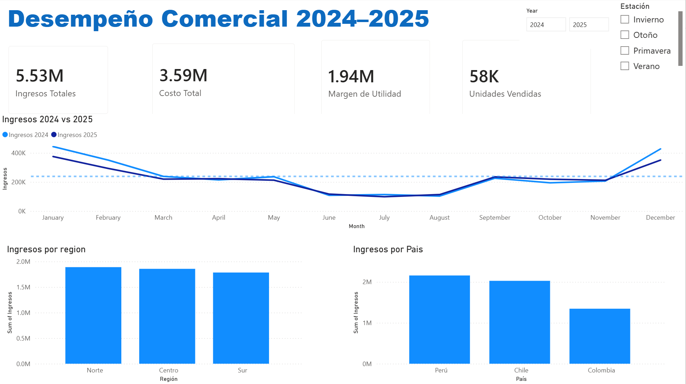
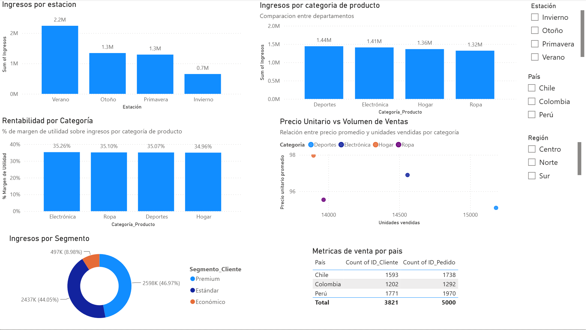

## 🔹1: Conexión y Exploración

- Importar el archivo excel en Power BI Desktop o en Tableau.
- Revisar tipos de datos.
- Identificar columnas clave.
- Explorar estructura general del dataset.

## 🔹2: Preparación de los datos

- Cambiar el formato de `Fecha_pedido` a español (Latinoamérica).
- Corregir los **tipos de datos** de columnas numéricas.
- Crear una columna condicional para usar como referencia ante metricas de negocio `Nivel_Venta` basada en `Ingresos`. Reglas:
  - Si `Ingresos` es mayor o igual a 1000 → "Venta Alta"
  - De lo contrario → "Venta Baja"

## 🔹3: Diseño y planificación del Dashboard (antes y durante la construcción)

#### Vista Overview - ¿Cómo ha evolucionado el ingreso total entre 2024 y 2025?
Cuales KPIs y por qué:
- Ingresos: Es la métrica que dirección mira primero, responde directamente "¿cómo va el negocio?".
- Costo: Sin costo, los ingresos no dicen nada sobre salud financiera. Es el dato que le da contexto al KPI de ingresos — un aumento en ingresos puede ser buena o mala noticia dependiendo de cómo se movió el costo.
- Margen / Utilidad: Es la métrica que realmente le importa a dirección ejecutiva, más que ingresos o costo por separado. Ingresos altos con margen bajo es una señal de alerta que solo se ve si calculas esta diferencia explícitamente. Es el KPI "resumen" de rentabilidad.
- Unidades Vendidas Totales: Da contexto de volumen: permite distinguir si el negocio crece por vender más o por vender más caro (relación con Precio_Unitario). Sin este dato, un aumento de ingresos podría malinterpretarse como crecimiento saludable cuando en realidad es solo efecto precio.
***
Que gráficos  y por qué.
- Gráfico de líneas ¿Cómo evolucionaron los ingresos 2024 vs 2025?

Por qué: la pregunta es sobre tendencia en el tiempo, y las líneas son el estándar visual para mostrar cambio continuo. Además, permite comparar dos periodos (2024 vs 2025) superponiendo las líneas, algo que barras o tarjetas no comunican con la misma claridad.
- Barras verticales  ¿Qué Regiones concentran más ingresos?

Por qué: es una comparación entre paises  sin relación de tiempo entre ellos. Las barras permiten comparar magnitudes de un vistazo, ordenadas de mayor a menor, que es justo lo que la pregunta busca.

- Barras verticales  ¿Qué países generan más ingresos?

Por qué: mismo principio que el grafico anterior — comparación entre entidades discretas (países) sin relación de tiempo. Con solo 3 países, barras comunican mejor que un mapa, que necesita más ubicaciones geográficas para justificar su uso.
***
Descripción de la jerarquía visual:
- Título — "Desempeño Comercial 2024–2025"

Elemento más grande y con color de marca (azul), ancla la página y da contexto inmediato de qué se está viendo.
- Tarjetas KPI (fila superior)

Segundo nivel de importancia por tamaño de fuente (números grandes en negro/gris oscuro). Es lo primero que el ojo lee después del título — responde "¿cómo vamos?" sin necesidad de interpretar ningún gráfico.
- Gráfico de líneas (Ingresos 2024 vs 2025)

Ubicado justo debajo de los KPIs y ocupando el ancho completo de la página — señala que es el segundo punto de atención: la tendencia que explica el "por qué" detrás de los números de arriba.
- Fila inferior — dos gráficos de apoyo Ingresos region / pais

Mismo tamaño entre sí, indicando que tienen igual jerarquía — son cortes complementarios, ninguno más importante que otro, todos aportando detalle adicional al mensaje principal.
- Slicers (Year, Estación)

Ubicados en la esquina superior derecha, con menor peso visual (tamaño de fuente pequeño) — son herramientas de control, no información en sí misma, por lo que correctamente no compiten con el contenido principal.
***
Filtro(s)
- Año
- Estacion
***
#### Vista detalle - ¿Por qué se han caido/subido/mantenido los ingresos?
Que gráficos  y por qué.
- Gráfico comparación estacional contra ingresos: Gráfico de barras para comparar si alguna epoca del ano tiene relevancia o genera algun comportamiento atipico.
- Gráfico comparación de categorias contra ingresos: Gráfico de barras para comparar si algun departamento esta teniendo un desempeno atipico.
- Gráfico comparación de categorias contra ingresos: Gráfico de barras para comparar si el % de margen de utilidad revela algun patron o tendencia.
- Gráfico de Donut ingresos por segmento: la pregunta busca entender proporción del total (qué % representa cada segmento), no solo magnitud absoluta. El donut comunica "parte de un todo" de forma más intuitiva que barras cuando son pocas categorías.
- Scatterplot relacion precio unitario y volumen de ventas: Con un simple vistazo podemos detectar si el precio influye directamente al volumen de ventas y en que medida.
- Tabla mostrando 3 columnas:
  - Conteo `ID_Pedido`
  - Conteo único `ID_Cliente`
  - Filtrado por `pais`
***
Filtros 
- `Estacion`
- `Pais`
- `Region`

## 🔹4: Narrativa con Modelo SCQA

## 🖥️ Vista General (Overview)

**S (Situación):**
El negocio generó **5.53M en ingresos** durante 2024–2025, con un costo asociado de 3.59M, dejando un margen de utilidad de **1.94M (35%)** sobre **58K unidades vendidas**. Perú, Chile y la Región Norte concentran la mayor parte de la facturación.

**C (Complicación):**
Los ingresos no se distribuyen de forma uniforme a lo largo del año: existe un **patrón estacional marcado**, con caídas sostenidas entre junio y agosto y picos en enero y diciembre. Al superponer 2024 y 2025, ambas líneas siguen una trayectoria muy similar, sin una separación clara que indique crecimiento — aunque esta lectura es visual y debe confirmarse con la variación % año contra año.

**Q (Pregunta):**
¿El negocio está creciendo, o simplemente repitiendo el mismo ciclo estacional sin ganar terreno real?

**A (Respuesta):**
A nivel agregado, el negocio se muestra **operativamente estable** (35% de margen consistente), pero el gráfico de tendencia no evidencia una separación clara entre 2024 y 2025. La respuesta al porqué de este patrón requiere bajar al detalle.

---

## 🔎 Vista Detalle

**S (Situación):**
Al desagregar, el 66% de los ingresos se concentra en **verano** (2.2M), mientras que invierno apenas aporta 0.7M — el ciclo estacional detectado en el Overview se confirma y se explica: el negocio depende fuertemente de una sola temporada. Las 4 categorías de producto (Deportes, Electrónica, Hogar, Ropa) están muy equilibradas en ingresos (1.3M–1.44M) y en margen (34.9%–35.3%).

**C (Complicación):**
Aunque las categorías generan ingresos similares, su comportamiento de mercado es distinto: **Hogar** vende poco volumen pero a precio alto (nicho premium), mientras **Deportes** vende más unidades a menor precio (volumen). En clientes, el segmento **Premium (47%) y Estándar (44%)** dominan casi por igual, dejando a **Económico marginado (9%)** — y Perú concentra el mayor número de clientes (1,771) y pedidos (1,970) de los tres países.

**Q (Pregunta):**
¿Dónde están las palancas de crecimiento si el negocio ya está saturado en su temporada fuerte y sus categorías tienen desempeño parejo?

**A (Respuesta):**
Las oportunidades no están en "vender más de lo mismo en verano", sino en **dos frentes concretos**: (1) diversificar la dependencia estacional impulsando invierno/otoño, hoy sub-explotados; y (2) capitalizar el segmento Premium — ya el más grande y probablemente el de mejor margen — mientras se evalúa si conviene invertir en crecer Económico o enfocar esfuerzos donde ya hay tracción (Perú, Premium, Deportes por volumen y Hogar por margen).

---

## 🔹5: Mensaje asincrónico

**📊 Resumen Desempeño Comercial 2024–2025**
>
> Cerramos el periodo con **5.53M en ingresos** y **35% de margen** — operación sólida y estable. 
>
> El hallazgo clave: **dependemos demasiado del verano** (66% de ingresos vs. solo 13% en invierno), y las 4 categorías de producto están parejas en desempeño — no hay una "estrella" que esté jalando el crecimiento.
>
> 🎯 **Oportunidad:** el segmento Premium ya es el más grande (47%) y Perú lidera en clientes — ahí hay tracción para capitalizar. El reto real es **romper la dependencia estacional** antes de pensar en escalar más volumen en la misma época del año.
>
> Detalle completo disponible en el dashboard 
